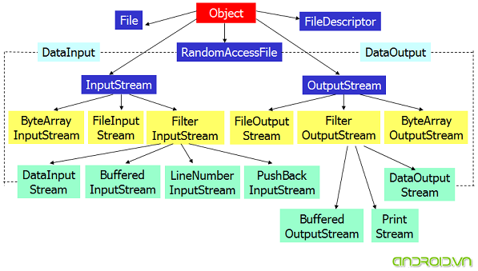

+++
date = '2025-10-19T15:14:28+07:00'
draft = false
title = '02 Quan Ly Cac Luong Nhap Xuat'
+++
Trong lập trình mạng Java, quá trình truyền nhận dữ liệu giữa Client và Server được thực hiện thông qua **Input/Output Streams (Luồng Nhập/Xuất)**.

# I. Khái niệm Luồng (Stream)
Luồng là một chuỗi dữ liệu (byte hoặc ký tự) chảy từ nguồn đến đích.
* **Input Stream:** Dùng để đọc dữ liệu từ nguồn (ví dụ: nhận dữ liệu từ Socket).
* **Output Stream:** Dùng để ghi dữ liệu ra đích (ví dụ: gửi dữ liệu qua Socket).

**Sơ đồ luồng I/O cơ bản:**



# II. Các lớp I/O chính trong Java

## 1. Luồng Byte (Byte Streams)
Thao tác với dữ liệu ở cấp độ **byte** (8 bit). Đây là cơ sở cho giao tiếp mạng.
* **Input**: `InputStream`, **`Socket.getInputStream()`**.
* **Output**: `OutputStream`, **`Socket.getOutputStream()`**.

## 2. Luồng Ký tự (Character Streams)
Thao tác với dữ liệu ở cấp độ **ký tự** (Unicode). Thường được dùng để xử lý văn bản.
* **Reader**: `Reader`, `BufferedReader` (đọc hiệu quả).
* **Writer**: `Writer`, `PrintWriter` (ghi hiệu quả).

# III. Ứng dụng trong Lập trình Socket
Khi kết nối TCP, chúng ta thường bao bọc luồng Byte cơ sở bằng luồng Ký tự để dễ dàng gửi/nhận chuỗi văn bản.

```java
// Ví dụ về việc dùng Streams trong Server Socket (Java)
try (PrintWriter out = new PrintWriter(clientSocket.getOutputStream(), true);
     BufferedReader in = new BufferedReader(new InputStreamReader(clientSocket.getInputStream()));
) {
    // Logic đọc/ghi dữ liệu
} catch (IOException e) {
    e.printStackTrace();
}