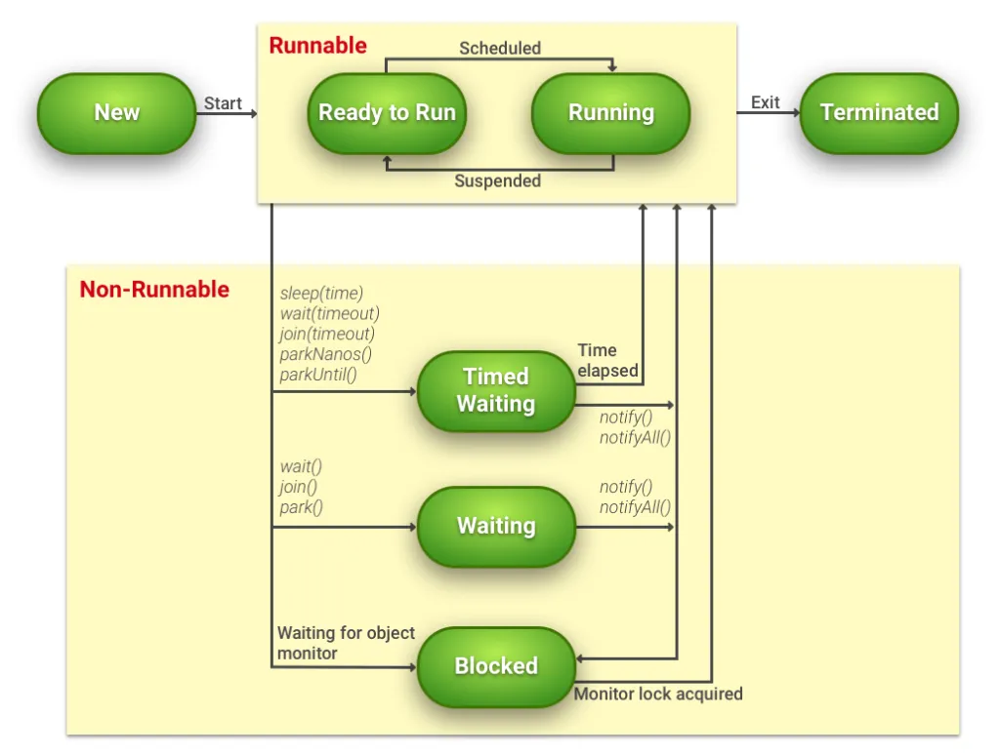

+++
date = '2025-10-19T15:14:40+07:00'
draft = false
title = '03 Lap Trinh Da Tuyen'
+++
Trong lập trình mạng, máy chủ phải xử lý nhiều yêu cầu đồng thời từ các Client. Lập trình Đa Tuyến (Multi-threading) là giải pháp cốt lõi để đạt được điều này.

# I. Tại sao cần Đa Tuyến trong Lập trình Mạng?
* **Phản hồi nhanh:** Mỗi Client được xử lý trên một **Thread** riêng biệt, giúp Server nhanh chóng chấp nhận kết nối tiếp theo.
* **Hiệu suất:** Tận dụng tối đa tài nguyên CPU đa nhân để xử lý đồng thời nhiều tác vụ I/O (chờ đợi dữ liệu).

# II. Khái niệm Thread (Tuyển)
Thread là một luồng thực thi độc lập bên trong một chương trình (Process).
* **Tạo Thread:** Bằng cách **Kế thừa lớp `Thread`** hoặc **Triển khai Interface `Runnable`**.

**Vòng đời cơ bản của Thread:**



# III. Đồng bộ hóa (Synchronization)
Khi nhiều Thread cùng truy cập và thay đổi một tài nguyên chung, có thể dẫn đến lỗi dữ liệu (Race Condition).
* **Giải pháp:** Từ khóa `synchronized` đảm bảo tại một thời điểm, chỉ có **một** Thread được phép thực thi đoạn code hoặc phương thức đó.

# IV. Ví dụ cơ bản (Triển khai Runnable)
```java
class ClientHandler implements Runnable {
    private Socket clientSocket;

    public ClientHandler(Socket socket) {
        this.clientSocket = socket;
    }

    @Override
    public void run() {
        // Logic xử lý kết nối, đọc/ghi dữ liệu từ clientSocket
    }
}

// Cách server khởi tạo Thread mới cho mỗi client:
// new Thread(new ClientHandler(acceptedSocket)).start();