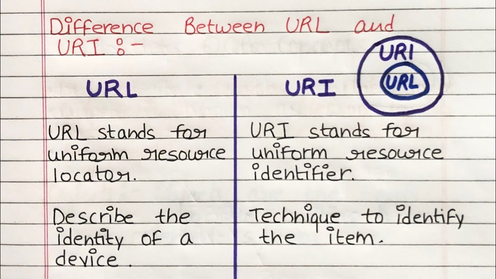

+++
date = '2025-10-19T15:14:52+07:00'
draft = false
title = 'Bài 04: Quản Lý Địa Chỉ Kết Nối Mạng'
+++
Lập trình mạng không thể thiếu việc định danh tài nguyên và thiết bị. Các khái niệm URI và URL là nền tảng cho việc này.

# I. URI (Uniform Resource Identifier)
URI là một chuỗi ký tự được sử dụng để định danh bất kỳ tài nguyên nào trên mạng (ví dụ: một tài liệu, hình ảnh, hoặc một dịch vụ).

## Cấu trúc URI
`Scheme:[//authority]path[?query][#fragment]`

# II. URL (Uniform Resource Locator)
URL là một **tập hợp con của URI**. Nó không chỉ định danh tài nguyên mà còn **cung cấp vị trí cụ thể** của tài nguyên đó và cách truy cập nó (dùng giao thức nào).

**Mô hình phân biệt URI và URL:**



# III. Địa chỉ IP và Lớp InetAddress
Trong Java, lớp **`java.net.InetAddress`** được dùng để đại diện cho địa chỉ Giao thức Internet (IP).

* **IPv4:** Ví dụ: `192.168.1.1`
* **IPv6:** Ví dụ: `fe80::1ff:fe23:4567:890a`

Lớp này giúp phân giải tên miền thành địa chỉ IP và ngược lại.

```java
try {
    InetAddress address = InetAddress.getByName("[www.google.com](https://www.google.com)");
    System.out.println("Host Name: " + address.getHostName());
    System.out.println("IP Address: " + address.getHostAddress());
} catch (UnknownHostException e) {
    e.printStackTrace();
}