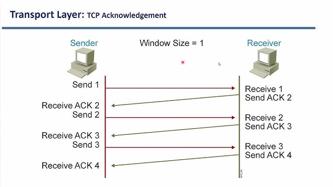

+++
date = '2025-10-19T15:15:07+07:00'
draft = false
title = 'Bài 05: Lập Trình Socket Cho Giao Thức TCP'
+++
TCP (Transmission Control Protocol) là giao thức **định hướng kết nối** và **đảm bảo độ tin cậy**. Lập trình TCP Socket là cách phổ biến nhất để xây dựng các ứng dụng Client-Server (như HTTP, FTP).

# I. Cơ chế Hoạt động (Three-way Handshake)
TCP thiết lập kết nối bằng quá trình "bắt tay 3 bước" (Three-way Handshake) để đảm bảo cả Client và Server sẵn sàng truyền dữ liệu.

**Luồng hoạt động TCP Socket:**



# II. Lập trình Server TCP Socket (Java)
Server lắng nghe trên một **Port** cụ thể bằng lớp `java.net.ServerSocket` và chờ Client kết nối.

```java
// Server Side:
ServerSocket serverSocket = new ServerSocket(8080);
System.out.println("Server listening on port 8080");

// Chờ Client kết nối
Socket clientSocket = serverSocket.accept(); 
System.out.println("Client connected: " + clientSocket.getInetAddress());
// Tiếp tục dùng I/O Streams (Bài 2) để trao đổi dữ liệu