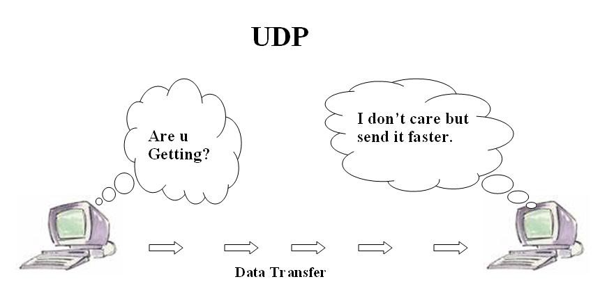

+++
date = '2025-10-19T15:15:28+07:00'
draft = false
title = 'Bài 07: Lập Trình Mạng Cho Giao Thức UDP'
+++
**UDP** (User **Datagram** **Protocol**) là giao thức truyền tải đơn giản và không đáng tin cậy. Nó hoạt động theo mô hình **không kết nối (Connectionless)** và nhanh hơn **TCP**.

# I. Đặc điểm của UDP
1.  **Không kết nối:** Không cần thiết lập kết nối trước khi truyền dữ liệu.
2.  **Không đáng tin cậy:** Không đảm bảo gói tin đến nơi, không đảm bảo thứ tự.
3.  **Hiệu suất cao:** Thích hợp cho **Video** **Streaming**, **Game** **Online** (có thể chấp nhận mất mát dữ liệu).

**Mô hình truyền nhận dữ liệu UDP:**



# II. Lớp DatagramSocket (Java)
Lớp `java.net.DatagramSocket` được sử dụng để gửi và nhận các gói dữ liệu **UDP** (Datagram).

# III. Lập trình Server UDP
Server **UDP** chỉ cần mở một **Socket** trên một **Port** và lắng nghe.

```java
// Server Side: Nhận gói tin từ bất kỳ đâu
DatagramSocket serverSocket = new DatagramSocket(9876);
byte[] receiveData = new byte[1024];

// Tạo gói tin DatagramPacket để nhận dữ liệu
DatagramPacket receivePacket = new DatagramPacket(receiveData, receiveData.length);
serverSocket.receive(receivePacket);

String message = new String(receivePacket.getData());
System.out.println("Received: " + message);