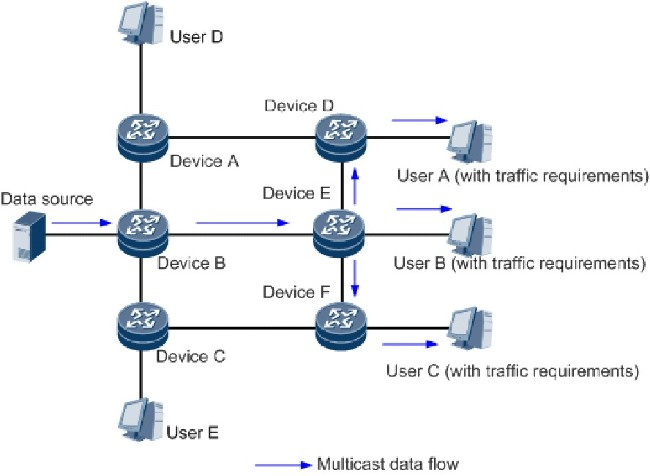

+++
date = '2025-10-19T15:15:42+07:00'
draft = false
title = 'Bài 08: Lập Trình Multicast'
+++
**Multicast** là phương pháp truyền thông cho phép một nguồn gửi dữ liệu tới **nhiều đích** cùng một lúc, sử dụng một địa chỉ **IP** nhóm duy nhất.

# I. Khái niệm Multicast Group
* **Địa chỉ Multicast:** Là các địa chỉ **IP** thuộc dải từ **224.0.0.0 đến 239.255.255.255** (Class D).
* **Tham gia nhóm:** Máy tính muốn nhận dữ liệu phải **tham gia (Join)** vào nhóm **Multicast** **Group**.

**Sơ đồ hoạt động của Multicast:**



# II. Lớp MulticastSocket (Java)
`java.net.MulticastSocket` là lớp con của `DatagramSocket`, được thiết kế để gửi và nhận gói tin **Multicast**.

# III. Lập trình Multicast Sender (Gửi)
Bên gửi chỉ cần tạo `MulticastSocket`, chỉ định địa chỉ **IP** nhóm và **Port**, rồi gửi `DatagramPacket`.

```java
// Sender Side:
MulticastSocket socket = new MulticastSocket();
InetAddress group = InetAddress.getByName("230.0.0.1"); // Địa chỉ nhóm
int port = 4446;

String message = "Tin nhắn Multicast!";
DatagramPacket packet = new DatagramPacket(message.getBytes(), message.length(), group, port);

socket.send(packet);
socket.close();