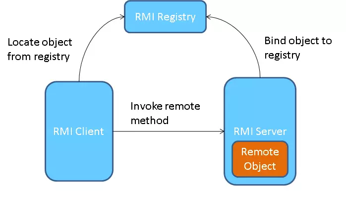

+++
date = '2025-10-19T15:15:56+07:00'
draft = false
title = 'Bài 09: Phân Tán Đối Tượng Trong Java Bằng RMI'
+++
**RMI** (**Remote** **Method** **Invocation**) là một cơ chế của **Java** cho phép một đối tượng chạy trên **JVM** này gọi các phương thức của một đối tượng chạy trên **JVM** khác. **RMI** là cốt lõi của lập trình ứng dụng phân tán bằng **Java**.

# I. Kiến trúc RMI (Client-Server)
Kiến trúc **RMI** bao gồm:
1.  **Remote Interface:** Định nghĩa các phương thức có thể được gọi từ xa.
2.  **Server (Remote Object):** Triển khai giao diện **Remote**.
3.  **Client:** Gọi các phương thức từ xa.
4.  **Registry:** Dịch vụ đặt tên để **Client** tìm kiếm đối tượng **Remote**.

**Mô hình kiến trúc RMI trong Java:**



# II. Các bước Lập trình RMI
1.  Định nghĩa **Remote** **Interface** (kế thừa `java.rmi.Remote`).
2.  Triển khai **Remote** **Object** (kế thừa `UnicastRemoteObject`).
3.  Chạy **RMI** **Registry** trên **Server**.
4.  Đăng ký **Remote** **Object** vào **Registry** (`Naming.rebind`).
5.  **Client** tìm kiếm đối tượng từ **Registry** (`Naming.lookup`) và gọi phương thức.

# III. Ví dụ về Remote Interface
Giao diện này phải được chia sẻ giữa **Client** và **Server**.

```java
import java.rmi.Remote;
import java.rmi.RemoteException;

public interface Calculator extends Remote {
    // Tất cả các phương thức đều phải throw RemoteException
    public int add(int a, int b) throws RemoteException;
}